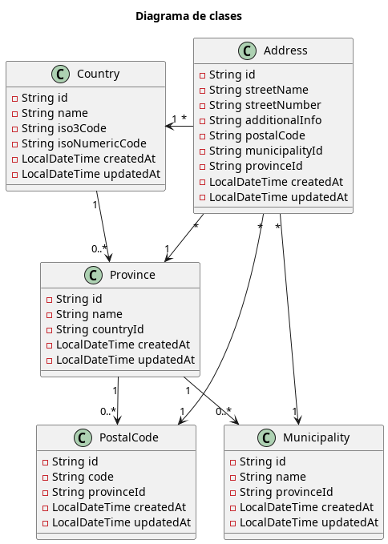

# Sample Spring Boot Thymeleaf + React

Esta aplicación es un ejemplo de una API basada en Spring Boot con dos frontales que la consumen. Uno con Spring Boot y Thymeleaf y otro con React. El objetivo es mostrar un ejemplo de estructura básica de proyectosde cara a una migración de aplicaciones legacy J2EE basadas en patrones MCV a una arquitectura más moderna basada en microservicios.

Personalmente no recomendaría el uso de Thymeleaf para nuevos proyectos ya que existen alternativas más modernas y eficientes como React, Angular u otros frameworks SPA. Sin embargo, Thymeleaf sigue siendo una opción válida para proyectos que requieren una integración estrecha con el backend de Spring Boot y para aquellos que prefieren una solución más tradicional basada en plantillas como evolución de proyectos legacy basados en patrones MVC.

También, la estructura del proyecto evita el uso de patrones DDD tales como agregados y en lugar de eso la lógica de negocio estaría organizada dentro de la capa de aplicación dentro de los manejadores CQRS. De este modo el dominio simlemente devolvería objetos de valor y entidades sin lógica de negocio.

## Módulos

- `sample-geo-api`: Contiene la lógica de negocio y las capas de servicio y repositorio.
- `sample-geo-front-thymeleaf`: Contiene los controladores y las vistas Thymeleaf.
- `sample-geo-front-react`: Contiene los componentes y la lógica de la aplicación React.

## Sample API

Este módulo expone una API REST para gestionar entidades geográficas como países, provincias y municipios. Utiliza una de arquitectura hexagonal aplicando el patrón CQRS para separar las operaciones de lectura y escritura.

El modelo utilizado es:

Utiliza Spring Data JPA para la persistencia de datos empleando RSQL para las consultas empleando una base de datos PostgreSQL.

La seguridad está basada en Spring Security utilizando la librería `spring-boot-starter-oauth2-resource-server` validando los tokens JWT a través de Keycloak.

Se ha definido la interface `Guard` para implementar un mecanismo de autorización basado en roles a nivel de operación en lugar de usar las anotaciones de Spring Security a nivel de método. Esto permite una mayor flexibilidad y control dentro de la logica de negocio y encaja más con el enfoque de arquitectura hexagonal.

Dentro de la paquetería `shared` se han definido diferentes componente que serían comunes a otros módulos como el cliente de la API, los DTOs, los mapeadores o las excepciones personalizadas. Estos componentes podrían ser extraídos a módulos independientes equivalentes a los starters de Spring Boot.

## Sample Front Thymeleaf

Este módulo está basado en Spring Web MVC y Thymeleaf para renderizar las vistas. Proporciona una interfaz de usuario para interactuar con la API REST del módulo `sample-geo-api`.

El cliente de la API está generado a través del plugin `org.openapi.generator` de gradle utilizando la opción `RestClient` para generar los conectores.

Este proyecto define un layout base muy sencillo utilizando componentes de Materialize CSS para el diseño y estilo de la aplicación.

Cada página está asociada a un `@Controller` que es responsable de manejar las solicitudes HTTP, interactuar con el cliente de la API y devolver la vista correspondiente.

## Sample Front React

Este módulo está basado en React utilizando TypeScript. Proporciona una interfaz de usuario moderna y dinámica para interactuar con la API REST del módulo `sample-geo-api`.

Para generar el proyecto hemos utilizado Vite con el template de React y TypeScript. Para ello ejecutamos los siguientes comandos:

[source, bash]
----
npm create vite@latest sample-geo-front-react -- --template react-ts
cd sample-geo-front-react
npm install
npm install oidc-client-ts react-oidc-context
npm install @mui/material @emotion/react @emotion/styled
npm install @mui/icons-material
----

Esto creará la estructura base que hemos modificado para añadir los componentes de la demo.

Para arrancar el proyecto en modo desarrollo ejecutaremos:

[source, bash]
----
npm run dev
----

TIP: Para el proyecto de React crearemos en Keycloak un nuevo cliente llamado `sample-client-react` con la autenticación de cliente desactivada.

## Ejecución

En este ejemplo se incluye un `docker-compose.yml` con diferentes recursos utilizados por la demo tales como PostgreSQL, Keycloak o Kafka.

En primer lugar arrancaremos los servicios:

[source, bash]
----
docker-compose up -d
----

En este punto tendremos que configurar Keycloak para crear un realm, un cliente y un usuario con el rol necesario para acceder a la API. Para ello accedemos a la consola de administración de Keycloak en `http://localhost:8090/auth` con las credenciales `admin:admin`.

Creamos un nuevo realm llamado `sample` y dentro de este un nuevo cliente llamado `sample-client` con la siguiente configuración:

----
- Client authentication: on
- Authorization: on
- PKCE Method: S256
----

También crearemos un rol llamado `geo-admin` y se lo asignaremos al usuario que crearemos posteriormente (podemos hacerlo a través de un grupo pero tendríamos que configurar el mapeo de roles en el cliente para que se incluyan en el token JWT).

A continuación crearemos un nuevo usuario al que habremos asignado el rol `geo-admin` para poder realizar operaciones de escritura sobre la API.

Una vez configurado Keycloak actualizaremos el secret generado para el cliente `sample-client` en los ficheros de configuración tanto de la API como del frontal.

Durante el arranque de la aplicación se cargarán varios datos de ejemplo para países, provincias y municipios a través de un `CommandLineRunner`.

Para compilar y ejecutarmente la API haremos:

[source,bash]
----
./gradlew clean build -x test

java -jar sample-api/build/libs/*.jar
----

Esto levantará nuestra API en el puerto 8082. Podemos consultar la información de la API a través de la documentación Swagger UI disponible en http://localhost:8082/swagger-ui/index.html.

A través del endpoint de actuator podremos comprobar el estado de la aplicación a través del endpoint
http://localhost:8082/actuator/health.

Lo mismo haremos para el frontal ejecutando los mismos comandos.

El frontal levantará la aplicación en el puerto 8081 de modo que podremos acceder a la aplicación en http://localhost:8081.

Desde aquí podremos navegar por las diferentes páginas y realizar operaciones CRUD sobre las provincias utilizando la API REST del módulo `sample-geo-api`.

Docker compose incluye una imagen de Kafka UI a la que podemos acceder a través de  http://localhost:8091/ usando las credenciales `admin:admin` para comprobar los mensajes que se publican en los topics de Kafka cada vez que se crea, actualiza o elimina una entidad.

## Comparativa

=== Thymeleaf

*Pros*:

- Uso de patrones MVC tradicionales, lo que puede ser más familiar para desarrolladores con experiencia en Java y Spring sin conocimientos en arquitecturas de frontends.
- Migración más sencilla para aplicaciones legacy basadas en patrones MVC.
- Menor frecuencia de actualización de dependencias.
- Comparte arquitectura y stack tecnológico con el backend, lo que puede facilitar la integración y el desarrollo para equipos con experiencia en Java.
- Mismo lenguaje para el frontend y el backend (hasta cierto punto en función de la complejidad que se quiera implementar en el frontend si no se quiere intentar hacer de una falsa SPA vía llamadas asíncronas a la antigua usanza).
- Menor complejidad en la configuración y el despliegue ya que utiliza los mismos procesos de CI/CD que el backend.
- Mejor tiempo de primera carga en aquellos casos de páginas pesadas o que involucren muchos componentes.
- Posibilidad de reutilizar componentes de servidor como los DTOs, mapeadores, validadores, etc. a través de la generación de código o el uso de módulos compartidos aunque esto es algo que debería evitarse de cara a la separación de responsabilidades entre el frontend y el backend que debería estar basada sólamente en contratos a través de APIs REST para los casos síncronos o eventos en los asínronos.

*Contras*:

- StateFull. Aunque es posible implementar aplicaciones sin estado utilizando Thymeleaf, en general se asocia más con aplicaciones stateful, lo que puede complicar la escalabilidad, mantenimiento y la separación entre dominios de cara a adoptar una arquitectura de microservicios.
- Menor interactividad y experiencia de usuario. Recarga completa de la página para cada interacción, lo que puede resultar en una experiencia de usuario menos fluida y más lenta en comparación con las aplicaciones SPA modernas.
- Los componentes reutilizables tienen un alto acoplamiento (_jar+version_) y muy baja cohesión (muchos pueden tener diferentes comportamientos dentro de todas las apps existentes), lo que puede dificultar su mantenimiento y evolución a largo plazo. Requisitos específicos de un módulo impactan a todos los módulos que lo utilizan. Esto deriva en los mismos problemas de los monolitos donde un cambio residual puede requerir la actualización de todos los módulos que lo utilizan.
- Lenguaje más áspero para desarrolladores. Mayor complejidad para implementar cualquier funcionalidad básica que dependa del DOM requiriendo el desarrollo de múltiples componentes reutilizables con el aumento consiguiente de los costes de mantenimiento y evolución.
- Mayor complejidad a la hora de añadir nuevas funcionalidades, especialmente cuando se dependen de datos dinámicos donde en el patrón MVN se reuqiere de la modificación del controlador (por ejemplo, añadir un nuevo _select_ a una vista requiere que el _controller_ realice la carga mientras que en un patrón SPA el componente se encargaría de realizar la llamada a la API para cargar los datos de forma dinámica).
- Mayor carga en el servidor debido a la necesidad de renderizar cada página en el servidor lo que deriva en mayores costes de infraestructura (aunque se optimice el uso de recursos sigue siendo una aplicación que requiere de una JVM con una importante huella de memoria que multiplicado por decenas de aplicaciones en muchos entornos implica unos costes nada despreciables).
- Librerías y herramientas limitadas en comparación con los frameworks modernos de frontend.
- Menos adecuado para aplicaciones modernas y dinámicas que requieren de una comunicación asíncrona fluida.
- Mayor complejidad para integrar diferentes aplicaciones dentro de una misma interfaz de usuario (respecto patrones de federación).
- Riesgos de mezclar responsabilidades entre el frontend y el backend, lo que puede llevar a una arquitectura monolítica difícil de mantener a largo plazo.
- Reutilización limitada de componente.
- La reutilización de componentes puede llevar al mismo problema de los monolitos de muy alto acoplamiento (a nivel de versiones de jars).
- Nada atractivo para perfiles modernos.
- Ecosistema cercano a cero.

=== React

*Pros*:

- Separación clara y real entre frontends y backends. No hay ninguna zona gris entre donde debería estar cada responsabilidad.
- Mejor experiencia de usuario.
- Amplio ecosistema de librerías y herramientas para el desarrollo frontend.
- Facilidad para definir componentes reutilizables.
- Capacidad de integración entre componentes a través de federación de módulos.
- Aislamiento de responsabilidades comunes a nivel de módulo (seguridad, i18n...) lo que simplifica la estructura de cada módulo.
- Costes de infraestructura cercanos a cero al no requerir de ningún servidor y poder ser desplegado en cualquier CDN.
- Perfiles de desarrolladores más especializados en frontend.
- Tencología más moderna y actualizada, lo que puede facilitar la atracción y retención de talento.
- Actúa como un policy a la hora de estructurar arquitecturas basadas en microservicios a la hora de requerir la implementación vía APIs de los contratos y funcionalidades, algo que con Thymeleaf es más fácil de saltarse.

*Contras*:

- Mayor frecuencia de actualización de dependencias.
- Mayor complejidad arquitectónica (por ejemplo a nivel de exposición de APIs, seguridad, etc.) y de configuración y despliegue.
- Curva de aprendizaje más pronunciada para perfiles Java sin experiencia en frontend.
- Complejidad adicional en casos de requisitos de SEO (aunque no aplicarían para la mayor parte de aplicaciones de gestiona).
- Riesgo de crear un monstruo mal diseñado que conserve los mismos problemas de los monolitos tradicionales y que incorpore una capa de complejidad de poco valor añadido a un stack tecnológico ya de por si complejo.
- Migración más compleja entre aplicaciones con funcionamiento legacy y modernas. En este caso no hay mucha diferencia con Thymeleaf aunque en determinados casos con Thymeleaf se pueden trampear problemas de integración que tengan que ver con la lógica de negocio de una forma más sencilla que con React, aunque estos sean casos que deberían evitarse pero que en casos donde se requieran de sesiones o de un comportamiento más diseñado para JSFs que fuera complejo mirar sería más complejo.

== Conclusiones

La opciṕn de Thymeleaf sólo me parece adecuada de cara a una migración suave y escalonada de aplicaciones legacy. En si misma no aporta nada de valor añadido a patrones obsoletos como Struts y debería, de ser considerada, un proceso de transición hacia una arquitectura más moderna.

Muchas de las características que añaden complejidad a React como puede ser la necesidad de una mayor frecuencia de actualizaciones pueden ser paliadas por patrones de diseño adecuados. Especialmente usando tecnologías no opinadas donde los equipos de desarrollo dispongan de un conjunto de componentes comunues que no requieran de su utilización directa y que puedan ser actualizados de forma independiente a través de la federación de módulos. De este modo se puede conseguir una arquitectura basada en microservicios con un frontend desacoplado del backend y con una experiencia de usuario moderna y fluida.

Este paradigma aislaría muchos elementos comunes de cada aplicación como puede ser la seguridad, layouts comunes, i18n, etc. dentro de módulos que simplemente tendrían una relación de dependencias en tiempo de ejecución (contratos a través de un APIM).

Y aunque la adopción de frameworks modernos requiera de más frecuencia de actualizaciones, en gran parte no se debe a roturas de API sino a vulnerabilidades que no son críticas en un entorno controlado de aplicaciones internas.

== Recomendación

Para una migración de aplicaciones monolíticas en primer lugar haría una refactorización interna para aislar:

- Separación del dominio de la aplicación (aislamiento absoluto pese a la naturaleza relacional del modelo de datos)
- Definición de la lógica de negocio (y modelo de objetos asociados)
- Interfaces en las que la aplicacion lee de sistemas externos (mayormente DBs)
- Interfaces en las que la aplicacion escribe a sistemas externos (mayormente DBs)
- Transaccionalidad de procesos (de container-based-transactions a transacciones distribuidas)

Con este nivel de aislamiento aplicar una refactorización lógica de negocio para categorizar los componentes dentro de tres capas principales:

- Dominio (generalmenete paqueterías de servicios)
- Infraestructura: donde la aplicación escribe.
- Interfaces: de donde la aplicación recibe peticiones externas.

Con una lógica separada se puede empezar a aplicar contratos entre cada una de las capas que sin que haya una sobreingenieria de interfaces, aislando y minimizando las depencecias entre cada uno de los módulos. Y en este punto de tener interfaces de lógica de negocio (separada la lectura y la escritura), estructuradas en las que cada componente monolítico se puede migrar a un dominio independiente, aunque sea inicialmente sin una ruptura arquitectónica.

El uso de un patrón de comandos y consultas puede ayudar a estructurar el comportamiento de cada aplicación e identificar claramente las operaciones que realiza.
Una vez identificados los contratos de entrada y salida (y aislados de tecnologías específicas dependientes de un determinado framework o librería) habría que asegurar una separación clara entre la capa de servicios y las diferentes capas de infraestructura (modelos de ORM, serializaciones, conversiones y demás trampas, etc.). Este nivel de aislamiento (no depender de entities, de stubs generados por clientes de implementacione REST/SOAP) nos aseguraría una primera versión de una separación real entre negocio e infraestructura.

Todo esto puede hacerse sin una ruptura tecnológica, usando el mismo paradigma J2EE/Spring/Whatever. Y una vez aislado el comportamiento de cada servicio a nivel de lógica real dentro del dominio, la migración de una tecnología a otra se puede hacer de una forma más sencilla tanto en cuanto sólo existe una capa de transformación entre las entidades de exposicion a las entidades de dominio.

Una vez el código esté modelado de este modo, el uso de un framework u otro no supondría nada más que cambiar los contratos de entrada y salida.

También, dentro de esa parte evitar todos los comportamientos AOP que no sean estrictamente necesarios a fin de que el flujo de la lógica sea lo más transparente posible, sin aspectos que afecten al comportamiento de la lógica. Si algo se ejecuta como un interceptor debe de ser debidamente justificado para evitar que ninguna lógica esté definida a nivel de aspectos.

Ok, separado todo eso y aislado el dominio no es posible que el código de negocio se pueda migrar porque de pronto en un fragmento se hace un rollback de una transacción o en otro la mezcla entre entidades y DTOS haga de un calvario separarlas. En esos casos Thymeleaf. Hacer un render de _session.userName_ y encogerse de hombros diciendo: se intentó.

Aunque, en general, si se aplican refactorizaciones para aislar a cada componente de sus funciones (la labor más compleja y tediosa), cualquier migración posterior a tal o cual framework es algo bastante sencillo.

Moraleja: no useis Thymeleaf, no para renderizar vistas al menos, usarlo para phishings si acaso ya que si que es un buen motor de plantillas.

## Enlaces

- https://www.thymeleaf.org/: Documentación oficial de Thymeleaf.
- https://openapi-generator.tech/docs/generators/spring/: Documentación del generador de código para Spring.

